<h1>一、实验目的</h1>

<h2>1、掌握Elasticsearch 安装IK分词器安装方法</h2>

 

<h2>2、掌握Elasticsearch 索引操作方法</h2>

 

 

<h2>3、掌握Elasticsearch 文档操作训练</h2>

 

<h2>4、掌握Elasticsearch 高级查询与DSL训练</h2>

 

 

<h1>二、实验内容</h1>

 <h2>1、索引操作练习</h2>

<h3>1.1创建索引</h3>

##### 创建索引指令如下：

##### 创建索引执行结果如下：

<h3>1.2修改索引(自己设计，修改要合理</h3>

##### 向user_information中增加一个number_of_use（使用次数）索引，命令如下：

运行结果如下：

<h3>1.3删除索引</h3>

##### 删除索引的指令如下：

##### 删除索引操作运行结果如下：

<h3>1.4查看所有</h3>

##### 命令如下：

##### 执行结果如下：

## 文档操作练习

### 1.创建文档

##### 向user_infomation中创建一号文档，命令如下：

##### 运行结果如下：

### 2.修改文档

##### 以下是POST更新文档的部分内容的命令：

##### 执行结果如下：

##### 以下是使用PUT更新文档的全部内容的命令：

##### 执行结果如下：

### 3.删除文档

##### 使用DELETE请求来删除1号ID文档，命令如下：

##### 执行结果如下：

### 4.查看文档

##### 在查看文档之前，由于我们刚刚删除了1号文档，所以先进行1号文档的建立，这里省略该步骤

##### 以下是查看1号文档的命令：

##### 执行结果如下：

### 5.将Json数据批量导入ES数据库中

##### 向user_information中传递数据，命令如下：

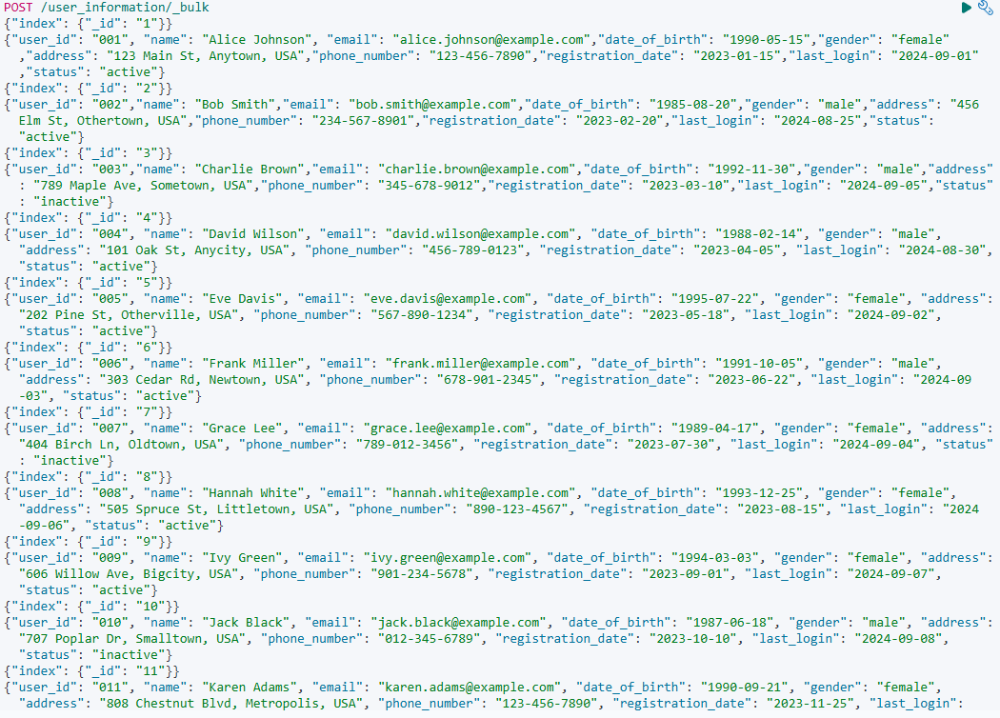

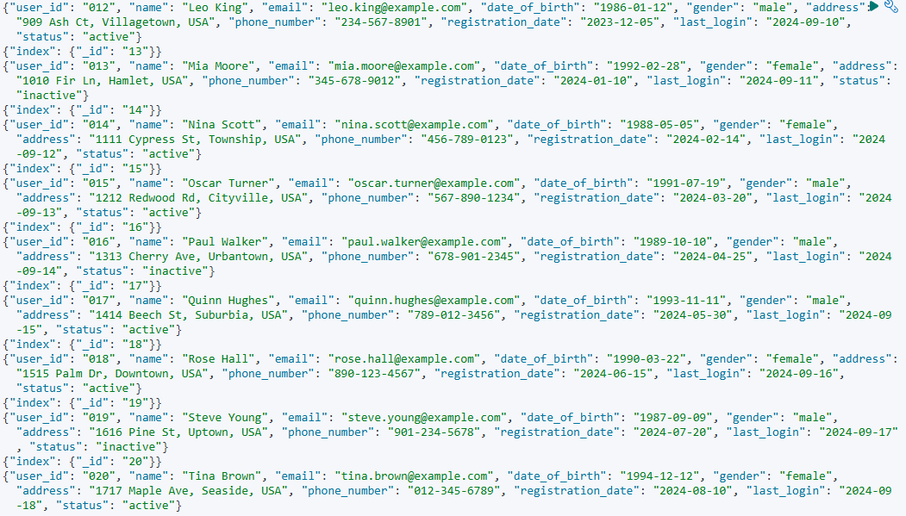

##### 执行结果如下：

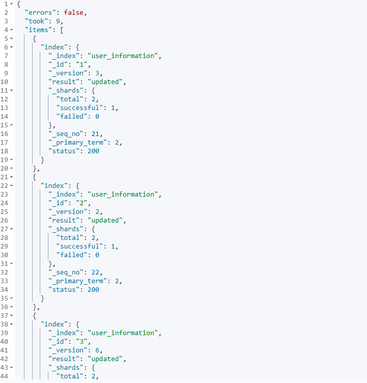

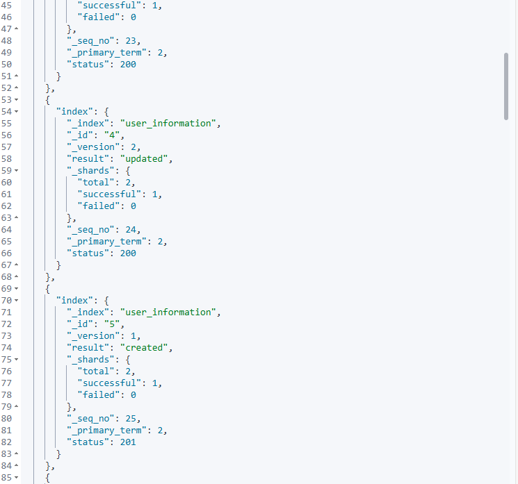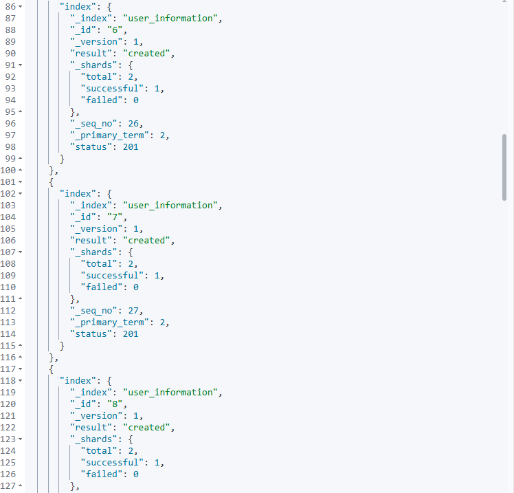

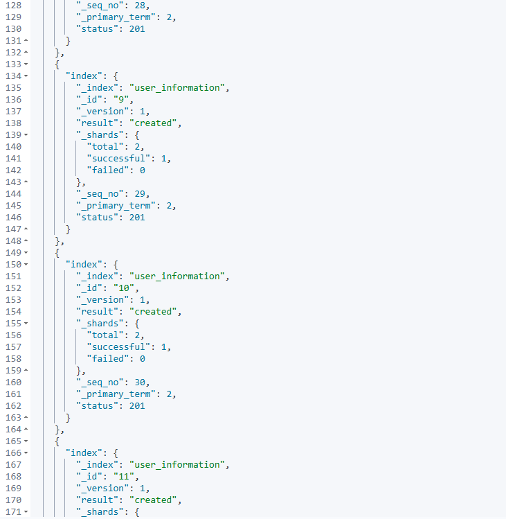

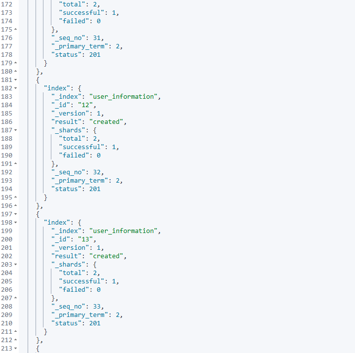

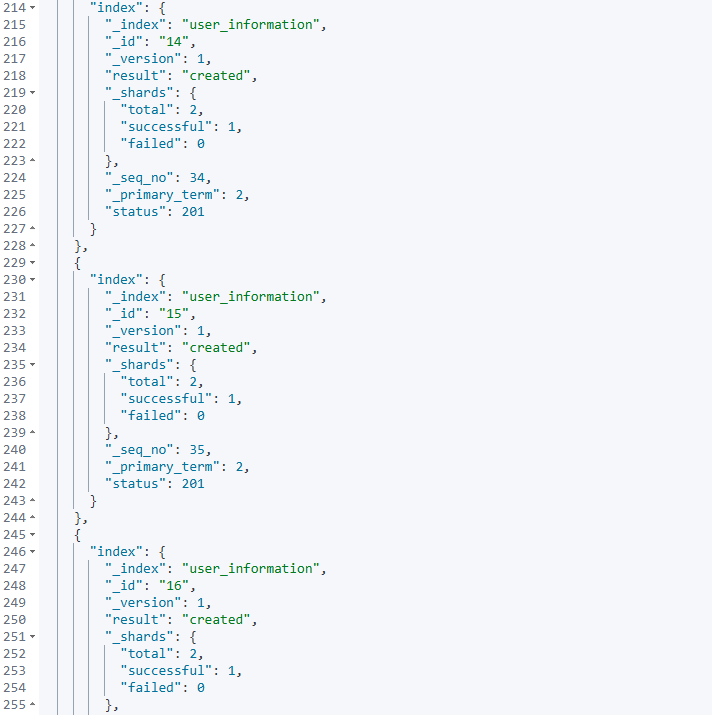

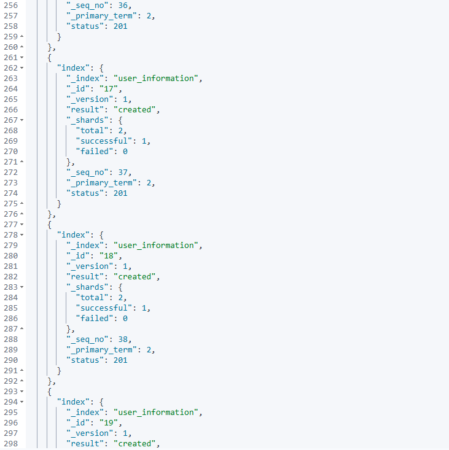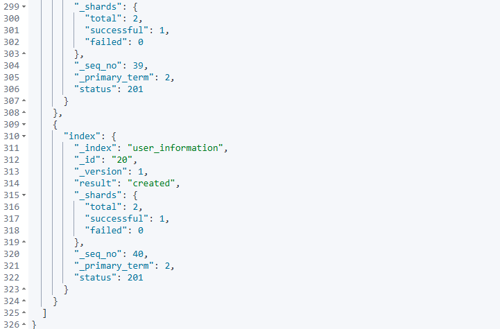

##### 向product_catalog中传递数据，命令如下：

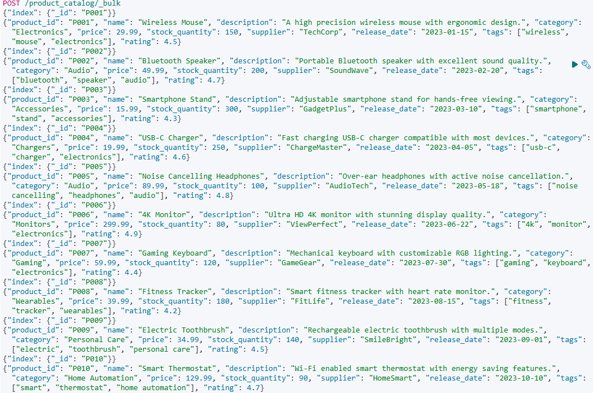

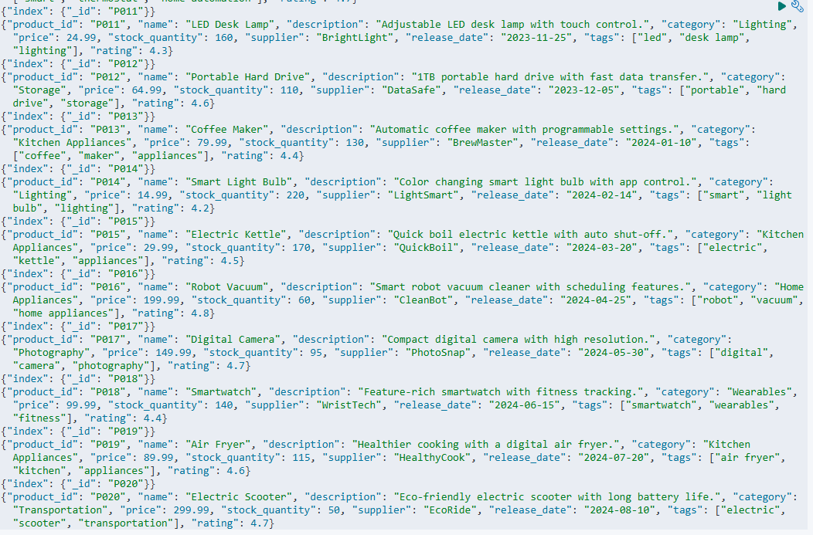

##### 执行结果如下：

    {
  "errors": false,
  "took": 162,
  "items": [
    {
      "index": {
        "_index": "product_catalog",
        "_id": "P001",
        "_version": 1,
        "result": "created",
        "_shards": {
          "total": 2,
          "successful": 1,
          "failed": 0
        },
        "_seq_no": 0,
        "_primary_term": 2,
        "status": 201
      }
    },
    {
      "index": {
        "_index": "product_catalog",
        "_id": "P002",
        "_version": 1,
        "result": "created",
        "_shards": {
          "total": 2,
          "successful": 1,
          "failed": 0
        },
        "_seq_no": 1,
        "_primary_term": 2,
        "status": 201
      }
    },
    {
      "index": {
        "_index": "product_catalog",
        "_id": "P003",
        "_version": 1,
        "result": "created",
        "_shards": {
          "total": 2,
          "successful": 1,
          "failed": 0
        },
        "_seq_no": 2,
        "_primary_term": 2,
        "status": 201
      }
    },
    {
      "index": {
        "_index": "product_catalog",
        "_id": "P004",
        "_version": 1,
        "result": "created",
        "_shards": {
          "total": 2,
          "successful": 1,
          "failed": 0
        },
        "_seq_no": 3,
        "_primary_term": 2,
        "status": 201
      }
    },
    {
      "index": {
        "_index": "product_catalog",
        "_id": "P005",
        "_version": 1,
        "result": "created",
        "_shards": {
          "total": 2,
          "successful": 1,
          "failed": 0
        },
        "_seq_no": 4,
        "_primary_term": 2,
        "status": 201
      }
    },
    {
      "index": {
        "_index": "product_catalog",
        "_id": "P006",
        "_version": 1,
        "result": "created",
        "_shards": {
          "total": 2,
          "successful": 1,
          "failed": 0
        },
        "_seq_no": 5,
        "_primary_term": 2,
        "status": 201
      }
    },
    {
      "index": {
        "_index": "product_catalog",
        "_id": "P007",
        "_version": 1,
        "result": "created",
        "_shards": {
          "total": 2,
          "successful": 1,
          "failed": 0
        },
        "_seq_no": 6,
        "_primary_term": 2,
        "status": 201
      }
    },
    {
      "index": {
        "_index": "product_catalog",
        "_id": "P008",
        "_version": 1,
        "result": "created",
        "_shards": {
          "total": 2,
          "successful": 1,
          "failed": 0
        },
        "_seq_no": 7,
        "_primary_term": 2,
        "status": 201
      }
    },
    {
      "index": {
        "_index": "product_catalog",
        "_id": "P009",
        "_version": 1,
        "result": "created",
        "_shards": {
          "total": 2,
          "successful": 1,
          "failed": 0
        },
        "_seq_no": 8,
        "_primary_term": 2,
        "status": 201
      }
    },
    {
      "index": {
        "_index": "product_catalog",
        "_id": "P010",
        "_version": 1,
        "result": "created",
        "_shards": {
          "total": 2,
          "successful": 1,
          "failed": 0
        },
        "_seq_no": 9,
        "_primary_term": 2,
        "status": 201
      }
    },
    {
      "index": {
        "_index": "product_catalog",
        "_id": "P011",
        "_version": 1,
        "result": "created",
        "_shards": {
          "total": 2,
          "successful": 1,
          "failed": 0
        },
        "_seq_no": 10,
        "_primary_term": 2,
        "status": 201
      }
    },
    {
      "index": {
        "_index": "product_catalog",
        "_id": "P012",
        "_version": 1,
        "result": "created",
        "_shards": {
          "total": 2,
          "successful": 1,
          "failed": 0
        },
        "_seq_no": 11,
        "_primary_term": 2,
        "status": 201
      }
    },
    {
      "index": {
        "_index": "product_catalog",
        "_id": "P013",
        "_version": 1,
        "result": "created",
        "_shards": {
          "total": 2,
          "successful": 1,
          "failed": 0
        },
        "_seq_no": 12,
        "_primary_term": 2,
        "status": 201
      }
    },
    {
      "index": {
        "_index": "product_catalog",
        "_id": "P014",
        "_version": 1,
        "result": "created",
        "_shards": {
          "total": 2,
          "successful": 1,
          "failed": 0
        },
        "_seq_no": 13,
        "_primary_term": 2,
        "status": 201
      }
    },
    {
      "index": {
        "_index": "product_catalog",
        "_id": "P015",
        "_version": 1,
        "result": "created",
        "_shards": {
          "total": 2,
          "successful": 1,
          "failed": 0
        },
        "_seq_no": 14,
        "_primary_term": 2,
        "status": 201
      }
    },
    {
      "index": {
        "_index": "product_catalog",
        "_id": "P016",
        "_version": 1,
        "result": "created",
        "_shards": {
          "total": 2,
          "successful": 1,
          "failed": 0
        },
        "_seq_no": 15,
        "_primary_term": 2,
        "status": 201
      }
    },
    {
      "index": {
        "_index": "product_catalog",
        "_id": "P017",
        "_version": 1,
        "result": "created",
        "_shards": {
          "total": 2,
          "successful": 1,
          "failed": 0
        },
        "_seq_no": 16,
        "_primary_term": 2,
        "status": 201
      }
    },
    {
      "index": {
        "_index": "product_catalog",
        "_id": "P018",
        "_version": 1,
        "result": "created",
        "_shards": {
          "total": 2,
          "successful": 1,
          "failed": 0
        },
        "_seq_no": 17,
        "_primary_term": 2,
        "status": 201
      }
    },
    {
      "index": {
        "_index": "product_catalog",
        "_id": "P019",
        "_version": 1,
        "result": "created",
        "_shards": {
          "total": 2,
          "successful": 1,
          "failed": 0
        },
        "_seq_no": 18,
        "_primary_term": 2,
        "status": 201
      }
    },
    {
      "index": {
        "_index": "product_catalog",
        "_id": "P020",
        "_version": 1,
        "result": "created",
        "_shards": {
          "total": 2,
          "successful": 1,
          "failed": 0
        },
        "_seq_no": 19,
        "_primary_term": 2,
        "status": 201
      }
    }
  ]
}

# 三、**问题及解决方法**

 